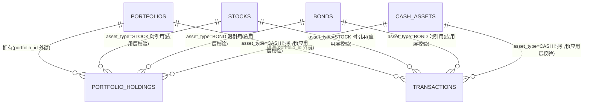

# 资产与持仓表设计（V3）

> 本文档描述 Nova Portfolio Manager 后端**当前**的数据库表结构。每次表结构发生变更（新增表/新增字段/调整约束）都应同步更新本文档。
>
> 范围说明：本版本**不包含**用户账户 / 认证体系（不存在 `users` 表，所有表当前均无 `user_id` 归属字段）。这是当前迭代的既定范围边界，而不是遗漏，后续引入多用户体系时需要额外设计 `users` 表以及各表与用户的归属关系。

## 1. 系统概览

系统当前共有 **6 张表**，分为三个层次：

1. **资产主数据层**（3 张表）：`stocks`（股票）、`bonds`（债券）、`cash_assets`（现金/外币），各自独立维护，是"可以被买卖/持有的资产"的参考数据源。
2. **组合层**（1 张表）：`portfolios`，代表一个资产组合（投资账户/篮子），是持仓和交易流水的归属容器。
3. **持仓与流水层**（2 张表）：
   - `portfolio_holdings`：某个组合当前持有某资产的**状态快照**（数量、平均成本）。
   - `transactions`：买入/卖出的**历史流水记录**（新增表），创建时会自动联动更新对应的 `portfolio_holdings` 行。



> Mermaid 的 ER 图无法表达"多态软外键"，上图中 `STOCKS`/`BONDS`/`CASH_ASSETS` 到 `PORTFOLIO_HOLDINGS`/`TRANSACTIONS` 的连线**不是**数据库物理外键，而是通过 `asset_type + asset_id` 组合在应用层校验的逻辑关系，详见第 4 节。此外，`TRANSACTIONS` 创建时会以代码方式联动写入 `PORTFOLIO_HOLDINGS`（详见第 5.3 节），这一"写时联动"关系无法用标准 ER 记号表示，因此未画在图中。

## 2. 表总览

| 表名 | 对应实体类 | 作用 | 主要使用场景/功能 |
|---|---|---|---|
| `portfolios` | `Portfolio` | 资产组合（账户/篮子）主数据 | Portfolios 页面增删改查；组合详情页头部信息 |
| `stocks` | `Stock` | 股票主数据 | Stocks 页面增删改查；Holdings/Transactions 中选择股票、计算市值 |
| `bonds` | `Bond` | 债券主数据 | Bonds 页面增删改查；Holdings/Transactions 中选择债券、计算市值 |
| `cash_assets` | `CashAsset` | 现金/外币主数据 | Cash Assets 页面增删改查；Holdings/Transactions 中选择现金资产、计算市值 |
| `portfolio_holdings` | `Holding` | 组合当前持仓状态（数量+平均成本快照） | 组合详情页的持仓列表、总市值、资产配置环形图、未实现盈亏 |
| `transactions` | `Transaction` | 买入/卖出历史流水（不可变账本） | Transactions 页面的录入表单与历史列表；创建时自动维护 `portfolio_holdings` |

## 3. 各表详情

### 3.1 `portfolios`（资产组合表）

**作用**：代表一个独立的资产组合/账户。是 `portfolio_holdings` 和 `transactions` 的父实体，删除组合会级联清理其名下的持仓与流水。

**使用场景**：Portfolios 列表页（创建/编辑/删除组合、展示描述）；组合详情页头部（名称、描述、创建/更新时间）。

| 字段 | Java 类型 | 数据库类型 | 约束 | 说明 |
|---|---|---|---|---|
| id | Long | BIGINT | PK, AUTO_INCREMENT | 主键 |
| portfolio_name | String | VARCHAR(128) | NOT NULL, UNIQUE | 组合名称；创建/更新时应用层校验唯一性 |
| description | String | VARCHAR(255) | NULL（可选） | 组合描述/备注。**新增字段**，DTO 层仅 `@Size(max=255)` 校验，不要求非空 |
| created_at | LocalDateTime | DATETIME | NOT NULL | 创建时间，由 `BaseTimeEntity` 自动填充 |
| updated_at | LocalDateTime | DATETIME | NOT NULL | 更新时间，由 `BaseTimeEntity` 自动填充 |

### 3.2 `stocks`（股票表）

**作用**：股票资产主数据（参考价目表），不归属于任何组合。

**使用场景**：Stocks 页面增删改查；创建 Holding/Transaction 时作为 `asset_type=STOCK` 的资产下拉数据源；`price` 用于计算持仓市值，`market_cap` 作为参考展示字段。

| 字段 | Java 类型 | 数据库类型 | 约束 | 说明 |
|---|---|---|---|---|
| id | Long | BIGINT | PK, AUTO_INCREMENT | 主键 |
| symbol | String | VARCHAR(32) | NOT NULL, UNIQUE | 股票代码，如 `AAPL` |
| name | String | VARCHAR(128) | NOT NULL | 公司名称 |
| sector | String | VARCHAR(64) | NOT NULL | 所属行业 |
| exchange | String | VARCHAR(64) | NOT NULL | 交易所 |
| price | BigDecimal | DECIMAL(19,4) | NOT NULL, DTO 校验 > 0 | 当前单价，用于市值计算 |
| market_cap | BigDecimal | DECIMAL(19,4) | NULL（可选）, DTO 校验 >= 0 | 市值。**新增字段** |
| created_at | LocalDateTime | DATETIME | NOT NULL | 创建时间 |
| updated_at | LocalDateTime | DATETIME | NOT NULL | 更新时间 |

### 3.3 `bonds`（债券表）

**作用**：债券资产主数据，不归属于任何组合。字段与业务逻辑本次**未变更**，随文档一并记录以保持完整性。

**使用场景**：Bonds 页面增删改查；创建 Holding/Transaction 时作为 `asset_type=BOND` 的资产下拉数据源；`current_price` 用于市值计算。

| 字段 | Java 类型 | 数据库类型 | 约束 | 说明 |
|---|---|---|---|---|
| id | Long | BIGINT | PK, AUTO_INCREMENT | 主键 |
| name | String | VARCHAR(128) | NOT NULL | 债券名称 |
| bond_type | String | VARCHAR(64) | NOT NULL | 债券类型 |
| issuer | String | VARCHAR(128) | NOT NULL | 发行机构 |
| interest_rate | BigDecimal | DECIMAL(8,4) | NOT NULL, DTO 校验 > 0 | 利率 |
| maturity_date | LocalDate | DATE | NOT NULL, DTO 校验创建时须为未来日期(`@Future`) | 到期日 |
| current_price | BigDecimal | DECIMAL(19,4) | NOT NULL, DTO 校验 > 0 | 当前单价，用于市值计算 |
| risk_level | String | VARCHAR(32) | NOT NULL | 风险等级；数据库层为自由文本，前端下拉框约定取值 `LOW`/`MEDIUM`/`HIGH` |
| created_at | LocalDateTime | DATETIME | NOT NULL | 创建时间 |
| updated_at | LocalDateTime | DATETIME | NOT NULL | 更新时间 |

### 3.4 `cash_assets`（现金资产表）

**作用**：现金/外币资产主数据，不归属于任何组合。本次**未变更**。

**使用场景**：Cash Assets 页面增删改查；创建 Holding/Transaction 时作为 `asset_type=CASH` 的资产下拉数据源；`exchange_rate` 用作该现金资产的"单价"参与市值计算。

| 字段 | Java 类型 | 数据库类型 | 约束 | 说明 |
|---|---|---|---|---|
| id | Long | BIGINT | PK, AUTO_INCREMENT | 主键 |
| currency | String | VARCHAR(16) | NOT NULL, UNIQUE | 币种代码，如 `USD` |
| exchange_rate | BigDecimal | DECIMAL(19,6) | NOT NULL, DTO 校验 > 0 | 对本位币汇率，参与市值计算 |
| created_at | LocalDateTime | DATETIME | NOT NULL | 创建时间 |
| updated_at | LocalDateTime | DATETIME | NOT NULL | 更新时间 |

### 3.5 `portfolio_holdings`（持仓表）

**作用**：表示"某组合当前持有某资产多少数量、平均成本是多少"的**当前状态快照**（不是历史记录）。既可以通过 Holdings 表单手动创建/编辑，也可以由 `transactions` 的 BUY/SELL 自动维护。

**使用场景**：组合详情页的持仓列表（含"编辑/移除"操作）、总市值汇总卡片、资产配置环形图、每笔持仓与合计的未实现盈亏（Unrealized P&L）展示。

| 字段 | Java 类型 | 数据库类型 | 约束 | 说明 |
|---|---|---|---|---|
| id | Long | BIGINT | PK, AUTO_INCREMENT | 主键 |
| portfolio_id | Long | BIGINT | NOT NULL, FK → `portfolios(id)` | 所属组合，`@ManyToOne(optional=false)` |
| asset_type | AssetType(enum) | VARCHAR(16) | NOT NULL | 资产类型：`STOCK`/`BOND`/`CASH`，以字符串形式存储 |
| asset_id | Long | BIGINT | NOT NULL | 资产 ID（软外键，指向的表由 `asset_type` 决定，见第 4 节） |
| quantity | BigDecimal | DECIMAL(19,4) | NOT NULL, DTO 校验 >= 0.0001 | 持仓数量 |
| average_cost | BigDecimal | DECIMAL(19,4) | 数据库层 NULL（可为空），DTO 层 `@NotNull` 必填、校验 >= 0 | 持仓的加权平均成本（单价）。**新增字段**，用于计算未实现盈亏 |
| created_at | LocalDateTime | DATETIME | NOT NULL | 创建时间 |
| updated_at | LocalDateTime | DATETIME | NOT NULL | 更新时间 |

附加约束：
- `UNIQUE (portfolio_id, asset_type, asset_id)`：同一组合下同一资产只保留一行。

> **为什么 `average_cost` 在数据库层允许 NULL？** 这是刻意的设计权衡：如果直接加 `NOT NULL` 且无默认值，在 `ddl-auto: update` 模式下对已有非空表执行 `ALTER TABLE` 会在 MySQL 严格模式下失败。因此该字段在数据库层保持可空，实际的"必填"约束由 `HoldingRequest` DTO 的 `@NotNull` 校验在 API 层强制执行，等价于对新数据生效、对历史脏数据不炸库。

### 3.6 `transactions`（交易流水表，新增）

**作用**：记录每一笔买入（BUY）/卖出（SELL）的**历史流水**，是不可变的账本记录——只提供新增与删除接口，**没有更新/编辑接口**。创建一条流水时会自动按加权平均成本法联动更新对应的 `portfolio_holdings` 行（详见第 5.3 节）。

**使用场景**：Transactions 页面的"录入交易"表单（选择组合、资产类型、具体资产、买/卖方向、数量、单价、日期）与"历史记录"表格（含删除操作）。

| 字段 | Java 类型 | 数据库类型 | 约束 | 说明 |
|---|---|---|---|---|
| id | Long | BIGINT | PK, AUTO_INCREMENT | 主键 |
| portfolio_id | Long | BIGINT | NOT NULL, FK → `portfolios(id)` | 所属组合，`@ManyToOne(optional=false)` |
| asset_type | AssetType(enum) | VARCHAR(16) | NOT NULL | 资产类型：`STOCK`/`BOND`/`CASH` |
| asset_id | Long | BIGINT | NOT NULL | 资产 ID（软外键，语义同 `portfolio_holdings.asset_id`） |
| transaction_type | TransactionType(enum) | VARCHAR(8) | NOT NULL | 交易方向：`BUY`/`SELL` |
| quantity | BigDecimal | DECIMAL(19,4) | NOT NULL, DTO 校验 >= 0.0001 | 本次交易数量 |
| price | BigDecimal | DECIMAL(19,4) | NOT NULL, DTO 校验 > 0 | 本次交易的成交单价（区别于持仓的 `average_cost`，这是单笔流水的真实成交价） |
| transaction_date | LocalDate | DATE | NOT NULL, DTO 校验不能晚于今天(`@PastOrPresent`) | 交易发生日期 |
| created_at | LocalDateTime | DATETIME | NOT NULL | 记录创建时间 |
| updated_at | LocalDateTime | DATETIME | NOT NULL | 记录更新时间 |

## 4. 表间关系

| 关系 | 类型 | 实现方式 |
|---|---|---|
| `portfolios` 1 — * `portfolio_holdings` | 真实外键 | `portfolio_holdings.portfolio_id` → `portfolios.id`，`@ManyToOne(optional=false)` |
| `portfolios` 1 — * `transactions` | 真实外键 | `transactions.portfolio_id` → `portfolios.id`，`@ManyToOne(optional=false)` |
| `stocks`/`bonds`/`cash_assets` 1 — * `portfolio_holdings` | 逻辑/软外键 | `portfolio_holdings.asset_type` 决定 `asset_id` 指向哪张表；无数据库物理外键，由 Service 层依据 `asset_type` 调用对应 Repository 的 `existsById` 校验 |
| `stocks`/`bonds`/`cash_assets` 1 — * `transactions` | 逻辑/软外键 | 同上，由 `TransactionServiceImpl.validateAssetExists()` 校验 |
| `transactions` → `portfolio_holdings` | 写时联动（非外键） | 创建 `transaction` 时，`TransactionServiceImpl.applyToHolding()` 实时查找/新增/更新/删除对应的 `portfolio_holdings` 行，详见第 5.3 节 |

**为什么资产引用不能用物理外键？** `portfolio_holdings.asset_id` / `transactions.asset_id` 需要根据 `asset_type` 的取值分别指向 `stocks`、`bonds`、`cash_assets` 三张不同的表，而关系型数据库无法让同一个字段同时对三张表建立外键约束。因此采用 `asset_type + asset_id` 组合，并将存在性校验下沉到应用层（创建/更新持仓或流水时，按 `asset_type` 触发对应资产表的 `existsById` 查询，不存在则返回 404）。

## 5. 关键业务规则

### 5.1 唯一性约束

- `portfolios.portfolio_name`：全局唯一（创建/更新时应用层校验，不含大小写/去重等特殊处理）。
- `stocks.symbol`：全局唯一。
- `cash_assets.currency`：全局唯一。
- `portfolio_holdings (portfolio_id, asset_type, asset_id)`：同一组合下同一资产只能有一行持仓记录（唯一约束 + 应用层校验双重保证）。
- `transactions` 无唯一性约束——同一资产允许存在多笔流水（这正是"流水"的语义）。

### 5.2 删除保护与级联删除

- 删除 `stocks`/`bonds`/`cash_assets` 中的一条资产记录前，会依次检查：
  1. 是否存在引用它的 `portfolio_holdings` 记录（`existsByAssetTypeAndAssetId`）→ 存在则拒绝，提示"referenced by existing holdings"。
  2. 是否存在引用它的 `transactions` 记录（`existsByAssetTypeAndAssetId`）→ 存在则拒绝，提示"referenced by existing transactions"。
  - 只有两者都不存在时才允许删除，避免产生悬空的 `asset_id` 引用。
- 删除 `portfolios` 中的一个组合（`PortfolioServiceImpl.delete()`，`@Transactional`）会按顺序级联清理：
  1. `transactionRepository.deleteByPortfolioId(id)` —— 先删除该组合下的所有交易流水；
  2. `holdingRepository.deleteByPortfolioId(id)` —— 再删除该组合下的所有持仓；
  3. `portfolioRepository.deleteById(id)` —— 最后删除组合本身。
  - 三步在同一个数据库事务中执行，任一步失败则整体回滚。

### 5.3 BUY / SELL 自动维护持仓（加权平均成本法）

创建一条 `transaction` 时，`TransactionServiceImpl.applyToHolding()` 会按 `transaction_type` 自动联动更新 `portfolio_holdings`：

**BUY（买入）**：
- 若该组合下已存在该资产的持仓行，按加权平均成本法重新计算：

$$\text{newAverageCost} = \frac{\text{existingQty} \times \text{existingAvgCost} + \text{incomingQty} \times \text{incomingPrice}}{\text{existingQty} + \text{incomingQty}}$$

  计算结果使用 `RoundingMode.HALF_UP` 四舍五入保留 4 位小数；持仓数量累加为 `existingQty + incomingQty`。
- 若不存在持仓行，则新建一行，`quantity = incomingQty`，`average_cost = incomingPrice`。

**SELL（卖出）**：
- 若该组合下不存在该资产的持仓行 → 拒绝，抛出 `IllegalArgumentException("Cannot sell: no existing holding for this asset in the portfolio")`。
- 若持仓数量小于本次卖出数量 → 拒绝，抛出 `IllegalArgumentException("Cannot sell: insufficient holding quantity")`。
- 否则持仓数量减少 `quantity`；若减少后数量恰好为 0，则**删除**该持仓行；否则保存新数量。卖出**不会**改变 `average_cost`（加权平均成本法的约定：卖出不影响剩余持仓的平均成本）。

**删除流水记录的边界**：`TransactionService.delete()` 只删除流水记录本身，**不会**反向撤销它对持仓造成的影响。这是有意为之的设计边界——如果两次 BUY 之间夹了一次 SELL，简单的"反向运算"无法正确地把加权平均成本还原，唯一正确的做法是基于完整流水重新从零重算整个持仓，而这超出了当前迭代的范围。

### 5.4 未实现盈亏（Unrealized P&L）计算

未实现盈亏在前端根据 `portfolio_holdings.average_cost` 与对应资产的当前单价（`stocks.price` / `bonds.current_price` / `cash_assets.exchange_rate`）实时计算，**不持久化**到数据库：

$$\text{unrealizedPnL} = (\text{unitPrice} - \text{averageCost}) \times \text{quantity}$$

若某条持仓的 `average_cost` 为空（历史遗留数据），则该行及组合汇总的 P&L 显示为"—"（不参与合计）。

## 6. 枚举类型

| 枚举 | 取值 | 存储方式 | 使用位置 |
|---|---|---|---|
| `AssetType` | `STOCK`, `BOND`, `CASH` | `@Enumerated(EnumType.STRING)`，存为字符串 | `portfolio_holdings.asset_type`, `transactions.asset_type` |
| `TransactionType` | `BUY`, `SELL` | `@Enumerated(EnumType.STRING)`，存为字符串 | `transactions.transaction_type` |

## 7. API 端点与表的对应关系

| 表 | 主要端点 | 说明 |
|---|---|---|
| `portfolios` | `GET/POST /api/portfolios`；`GET/PUT/DELETE /api/portfolios/{id}`；`GET /api/portfolios/{id}/holdings` | 组合 CRUD；查询某组合下的全部持仓 |
| `stocks` | `GET/POST /api/stocks`；`GET/PUT/DELETE /api/stocks/{id}` | 股票主数据 CRUD |
| `bonds` | `GET/POST /api/bonds`；`GET/PUT/DELETE /api/bonds/{id}` | 债券主数据 CRUD |
| `cash_assets` | `GET/POST /api/cash-assets`；`GET/PUT/DELETE /api/cash-assets/{id}` | 现金资产主数据 CRUD |
| `portfolio_holdings` | `GET/POST /api/holdings`（支持 `?portfolioId=` 过滤）；`GET/PUT/DELETE /api/holdings/{id}`；`GET /api/holdings/portfolio/{portfolioId}` | 持仓 CRUD（手动模式，无自动联动） |
| `transactions` | `GET/POST /api/transactions`（支持 `?portfolioId=` 过滤）；`GET/DELETE /api/transactions/{id}` | 流水的新增/查询/删除；**无更新接口**（不可变记录） |

## 8. 前端页面与表的对应关系

| 页面（路由） | 使用的表 |
|---|---|
| Portfolios（`#/portfolios`） | `portfolios` |
| Portfolio Detail（`#/portfolios/{id}`） | `portfolios`、`portfolio_holdings`、`stocks`/`bonds`/`cash_assets`（读取单价用于市值与盈亏计算） |
| Stocks（`#/stocks`） | `stocks` |
| Bonds（`#/bonds`） | `bonds` |
| Cash Assets（`#/cash-assets`） | `cash_assets` |
| Transactions（`#/transactions`） | `transactions`、`portfolios`、`stocks`/`bonds`/`cash_assets`（用于表单资产下拉与历史列表展示） |

## 9. 参考 DDL（MySQL 8）

> 生产/开发环境实际由 Hibernate `ddl-auto: update` 自动维护表结构；以下 DDL 供手工建库、评审或迁移脚本参考。

```sql
CREATE TABLE portfolios (
    id BIGINT PRIMARY KEY AUTO_INCREMENT,
    portfolio_name VARCHAR(128) NOT NULL UNIQUE,
    description VARCHAR(255) NULL,
    created_at DATETIME NOT NULL,
    updated_at DATETIME NOT NULL
);

CREATE TABLE stocks (
    id BIGINT PRIMARY KEY AUTO_INCREMENT,
    symbol VARCHAR(32) NOT NULL UNIQUE,
    name VARCHAR(128) NOT NULL,
    sector VARCHAR(64) NOT NULL,
    exchange VARCHAR(64) NOT NULL,
    price DECIMAL(19,4) NOT NULL,
    market_cap DECIMAL(19,4) NULL,
    created_at DATETIME NOT NULL,
    updated_at DATETIME NOT NULL
);

CREATE TABLE bonds (
    id BIGINT PRIMARY KEY AUTO_INCREMENT,
    name VARCHAR(128) NOT NULL,
    bond_type VARCHAR(64) NOT NULL,
    issuer VARCHAR(128) NOT NULL,
    interest_rate DECIMAL(8,4) NOT NULL,
    maturity_date DATE NOT NULL,
    current_price DECIMAL(19,4) NOT NULL,
    risk_level VARCHAR(32) NOT NULL,
    created_at DATETIME NOT NULL,
    updated_at DATETIME NOT NULL
);

CREATE TABLE cash_assets (
    id BIGINT PRIMARY KEY AUTO_INCREMENT,
    currency VARCHAR(16) NOT NULL UNIQUE,
    exchange_rate DECIMAL(19,6) NOT NULL,
    created_at DATETIME NOT NULL,
    updated_at DATETIME NOT NULL
);

CREATE TABLE portfolio_holdings (
    id BIGINT PRIMARY KEY AUTO_INCREMENT,
    portfolio_id BIGINT NOT NULL,
    asset_type VARCHAR(16) NOT NULL,
    asset_id BIGINT NOT NULL,
    quantity DECIMAL(19,4) NOT NULL,
    average_cost DECIMAL(19,4) NULL,
    created_at DATETIME NOT NULL,
    updated_at DATETIME NOT NULL,
    CONSTRAINT fk_holding_portfolio FOREIGN KEY (portfolio_id) REFERENCES portfolios(id),
    CONSTRAINT uk_portfolio_asset UNIQUE (portfolio_id, asset_type, asset_id)
);

CREATE TABLE transactions (
    id BIGINT PRIMARY KEY AUTO_INCREMENT,
    portfolio_id BIGINT NOT NULL,
    asset_type VARCHAR(16) NOT NULL,
    asset_id BIGINT NOT NULL,
    transaction_type VARCHAR(8) NOT NULL,
    quantity DECIMAL(19,4) NOT NULL,
    price DECIMAL(19,4) NOT NULL,
    transaction_date DATE NOT NULL,
    created_at DATETIME NOT NULL,
    updated_at DATETIME NOT NULL,
    CONSTRAINT fk_transaction_portfolio FOREIGN KEY (portfolio_id) REFERENCES portfolios(id)
);
```

## 10. 已知设计边界（暂不包含 / 后续可扩展）

- **无用户/认证体系**：当前所有表均无 `user_id`，不区分数据归属用户，也没有登录/权限控制。这是本次迭代明确排除的范围，后续如需支持多用户，需要新增 `users` 表并评估是否给 `portfolios`（进而间接给 `portfolio_holdings`/`transactions`）加上归属外键。
- **删除流水不反向撤销持仓**：见 5.3 节，属于有意保留的行为，而非缺陷。
- **`average_cost` 数据库层可空**：见 3.5 节，是为兼容存量数据的迁移安全策略，非最终目标状态。
- **无资产价格历史**：`stocks.price` / `bonds.current_price` / `cash_assets.exchange_rate` 均只保存"当前值"，没有独立的价格历史表，因此无法回溯历史某天的市值或计算真实的已实现盈亏（realized P&L），只能计算基于当前价格的未实现盈亏。

